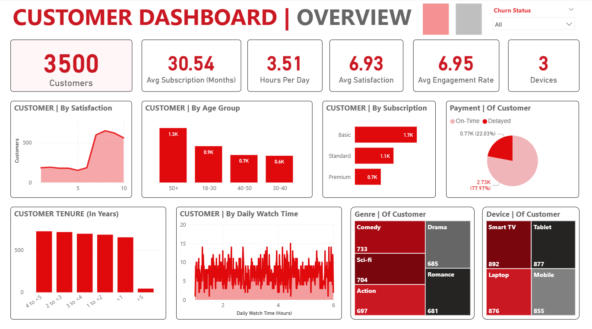
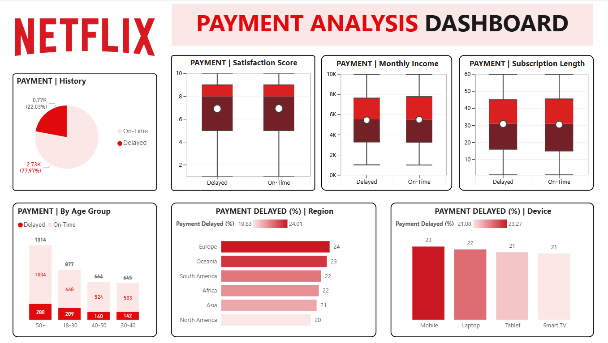
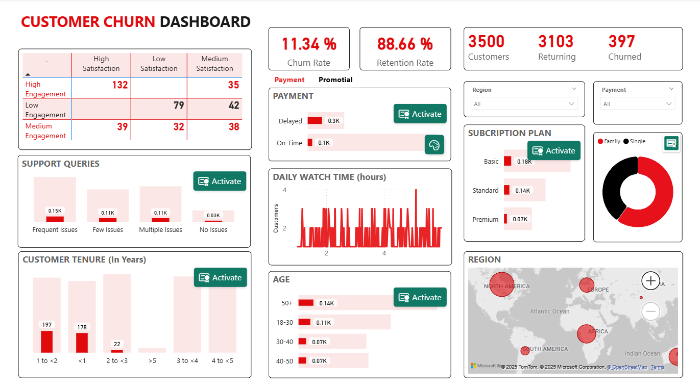

# Netflix Customers Analysis & Dashboard Project

Phân tích hành vi người dùng Netflix và trực quan hóa thông tin bằng Power BI & Python. Dự án khai thác dữ liệu từ Netflix để hiểu sâu hơn về khách hàng, hành vi thanh toán, tỷ lệ churn và các yếu tố ảnh hưởng đến trải nghiệm người dùng.

## Mô tả

| Tên tệp | Mô tả |
|--------|-------|
| `Netflix Engagement Dataset.xlsx` | Dữ liệu thô từ Netflix (hành vi, thanh toán, lượt xem...) |
| `Netflix_TienXuly.ipynb` | Notebook Python xử lý, làm sạch và khám phá dữ liệu |
| `Netflix_AnalyticalApproach.txt` | Hướng phân tích dữ liệu |
| `NetflixCustomers_Dashboard.pbix` | Dashboard tổng hợp khách hàng và thông tin cốt lõi |

## Dashboard Preview

> Dưới đây là hình ảnh dashboard

  

  

## Công Cụ Sử Dụng

- **Power BI**: xây dựng dashboard tương tác
- **Python (Pandas, Matplotlib)**: Tiền xử lý dữ liệu
- **Excel**: lưu trữ và quản lý dữ liệu ban đầu

## Giới Thiệu Cá Nhân

Dự án được thực hiện bởi *Trần Thị Minh Ngọc* – sinh viên định hướng theo lĩnh vực Phân tích Dữ liệu và Business Intelligence.  
Mong muốn phát triển trong các vai trò liên quan đến phân tích dữ liệu, xây dựng dashboard, và hỗ trợ ra quyết định kinh doanh dựa trên dữ liệu.

📬 Email: [minhngoc04.work@gmai@.com]

